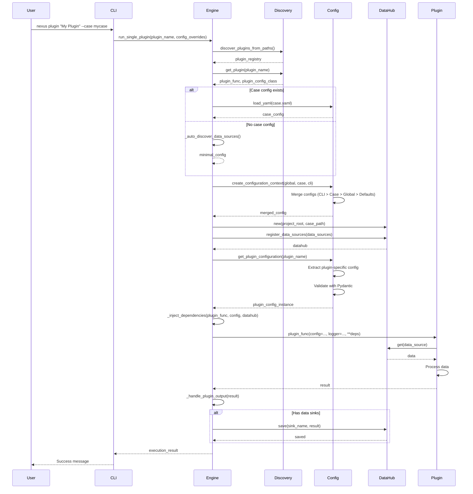
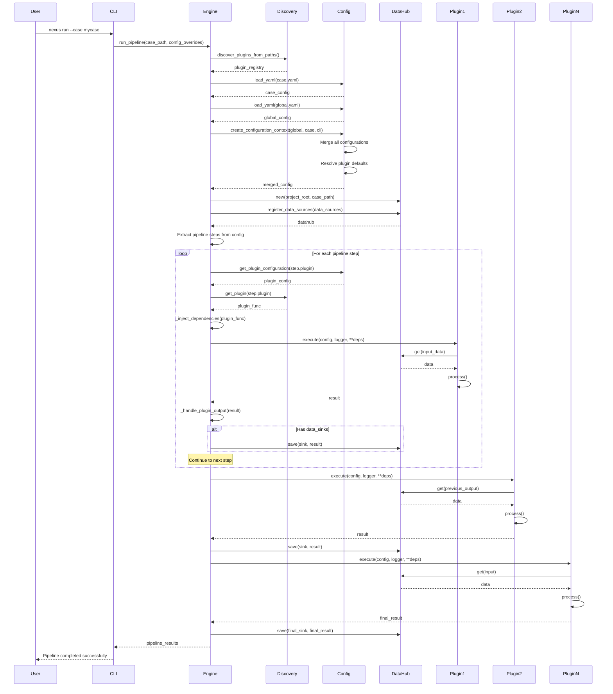
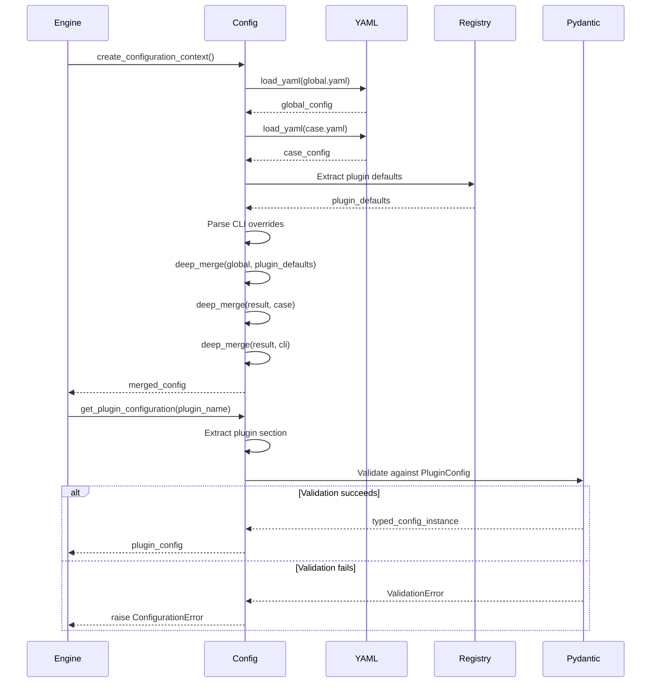
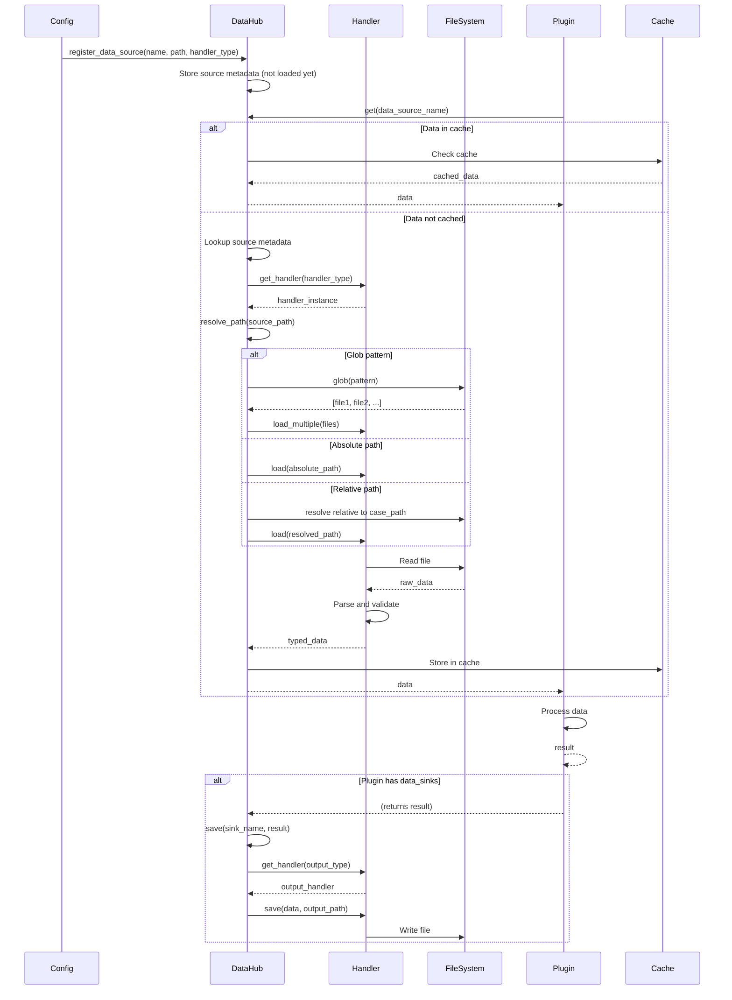
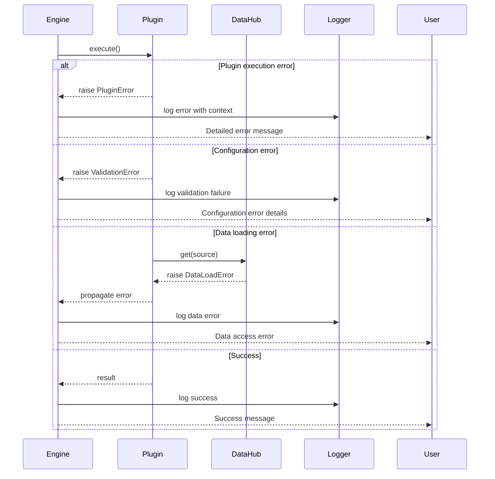

# Execution Flows

This document provides detailed execution flow diagrams to help understand how Nexus processes data pipelines.

---

## Table of Contents

- [Overview](#overview)
- [Single Plugin Execution](#single-plugin-execution)
- [Full Pipeline Execution](#full-pipeline-execution)
- [Configuration Resolution](#configuration-resolution)
- [Data Flow](#data-flow)

---

## Overview

Nexus supports two primary execution modes:

1. **Single Plugin Execution** - Run individual plugins with `nexus plugin <name>`
2. **Full Pipeline Execution** - Run complete pipelines with `nexus run --case <case>`

---

## Single Plugin Execution

### Command
```bash
nexus plugin "My Plugin" --case mycase --config key=value
```

### Sequence Diagram



### Flow Steps

1. **Plugin Discovery**
   - Scan plugin directories and modules
   - Register all plugins in PLUGIN_REGISTRY
   - Extract plugin metadata (name, config class, dependencies)

2. **Configuration Loading**
   - Check if case.yaml exists
   - If yes: Load case configuration
   - If no: Auto-discover data files in case directory, create minimal config
   - Load global.yaml for default plugin configurations

3. **Configuration Resolution**
   - Load global.yaml (provides plugin behavior defaults)
   - Load case.yaml (if exists, or use auto-discovered config)
   - Apply CLI overrides
   - Merge with hierarchy: CLI > Case > Template > Global > Plugin Defaults

4. **DataHub Setup**
   - Create DataHub instance
   - Register global data sources (if any defined in configuration)
   - Plugin I/O paths registered automatically from DataSource/DataSink annotations
   - Set up lazy loading for data files

5. **Plugin Configuration**
   - Extract plugin-specific configuration from merged config
   - Validate against plugin's PluginConfig class
   - Create typed configuration instance

6. **Dependency Injection**
   - Inspect plugin function signature
   - Resolve dependencies:
     - `config` → Plugin configuration instance
     - `logger` → Configured logger
     - `datahub` → DataHub instance
     - Data sources → Loaded from DataHub
   - Inject all dependencies as keyword arguments

7. **Plugin Execution**
   - Call plugin function with injected dependencies
   - Plugin accesses data via DataHub
   - Plugin processes data
   - Plugin returns result

8. **Output Handling**
   - Check plugin config for DataSink annotated fields
   - If yes: Save results to specified paths via DataHub
   - Log execution summary

---

## Full Pipeline Execution

### Command
```bash
nexus run --case mycase --config key=value
```

### Sequence Diagram



### Flow Steps

1. **Initialization Phase**
   - Discover all available plugins
   - Load case configuration (case.yaml)
   - Load global configuration (global.yaml)
   - Parse CLI overrides

2. **Configuration Resolution Phase**
   - Create unified configuration context
   - Merge configurations with proper precedence
   - Extract plugin defaults from registry
   - Validate configuration schema

3. **Setup Phase**
   - Initialize DataHub
   - Register all data sources
   - Parse pipeline definition
   - Validate pipeline structure

4. **Execution Phase** (For each step)
   - Extract step configuration
   - Get plugin function from registry
   - Prepare plugin-specific configuration
   - Inject dependencies (config, logger, datahub, data sources)
   - Execute plugin
   - Handle outputs and data sinks
   - Save intermediate results to DataHub

5. **Completion Phase**
   - Verify all steps completed
   - Save final outputs
   - Generate execution summary
   - Log pipeline statistics

---

## Configuration Resolution

### Sequence Diagram



### Hierarchy (Highest to Lowest Precedence)

```
┌─────────────────────────────────────┐
│      1. CLI Arguments               │  Highest Priority
│      --config key=value             │
└─────────────────────────────────────┘
              ↓ Overrides
┌─────────────────────────────────────┐
│      2. Case Configuration          │
│      case.yaml                      │
└─────────────────────────────────────┘
              ↓ Overrides
┌─────────────────────────────────────┐
│      3. Template Configuration      │
│      templates/*.yaml               │
└─────────────────────────────────────┘
              ↓ Overrides
┌─────────────────────────────────────┐
│      4. Global Configuration        │
│      config/global.yaml             │
└─────────────────────────────────────┘
              ↓ Overrides
┌─────────────────────────────────────┐
│      5. Plugin Defaults             │  Lowest Priority
│      From PluginConfig class        │
└─────────────────────────────────────┘
```

---

## Data Flow

### Sequence Diagram



### Path Resolution Rules

1. **Glob Patterns** (`**/*.csv`)
   - Treated as glob patterns
   - Searched relative to case directory
   - Multiple files loaded and combined

2. **Absolute Paths** (`C:\data\file.csv` or `/data/file.csv`)
   - Used as-is
   - No path resolution needed

3. **Relative Paths** (`data/input.csv`)
   - Resolved relative to case directory
   - Falls back to project root if not found in case

4. **Named Sources** (`raw_data`)
   - Looked up in data_sources configuration
   - Path resolution applied based on configured path

---

## Key Concepts

### Lazy Loading
- Data files are NOT loaded during registration
- Data is loaded only when `datahub.get()` is called
- Loaded data is cached for subsequent access
- Reduces memory footprint for large pipelines

### Dependency Injection
- Plugin dependencies are automatically resolved
- Inspection of function signature determines required dependencies
- Dependencies injected as keyword arguments
- Supports: config, logger, datahub, and any registered data source

### Configuration Caching
- Configuration resolution is cached using `@lru_cache`
- Cache key includes hashes of all configuration sources
- Cache invalidates when any configuration changes
- Improves performance for repeated executions

### Immutable Contexts
- All contexts are frozen dataclasses
- Prevents accidental mutations during execution
- Enables safe concurrent execution
- Makes data flow easier to reason about

---

## Performance Characteristics

### Single Plugin Execution
- **Overhead**: Minimal (plugin discovery + config resolution)
- **Memory**: Only loads required data sources
- **Speed**: Fast for individual plugins

### Full Pipeline Execution
- **Overhead**: Moderate (full config resolution + all plugins discovered)
- **Memory**: Loads data sources as needed (lazy loading)
- **Speed**: Depends on pipeline complexity and data size

### Optimization Tips

1. **Use caching**: Configuration and data are cached automatically
2. **Lazy loading**: Don't access unnecessary data sources
3. **Selective discovery**: Use specific plugin paths for faster discovery
4. **Configuration**: Keep configurations small and focused

---

## Error Handling Flow



### Error Categories

1. **Configuration Errors**
   - Invalid YAML syntax
   - Schema validation failures
   - Missing required fields
   - Type mismatches

2. **Plugin Errors**
   - Plugin not found
   - Missing dependencies
   - Execution failures
   - Invalid outputs

3. **Data Errors**
   - File not found
   - Invalid file format
   - Type mismatches
   - I/O errors

4. **System Errors**
   - Permission issues
   - Out of memory
   - Disk space issues

---

This document provides a comprehensive view of how Nexus executes plugins and pipelines. For more details on specific components, refer to the [Architecture](architecture.md) documentation.
