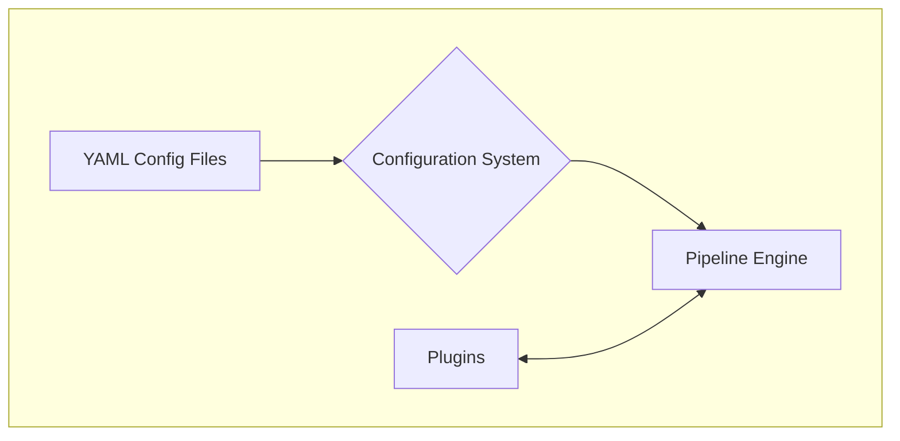
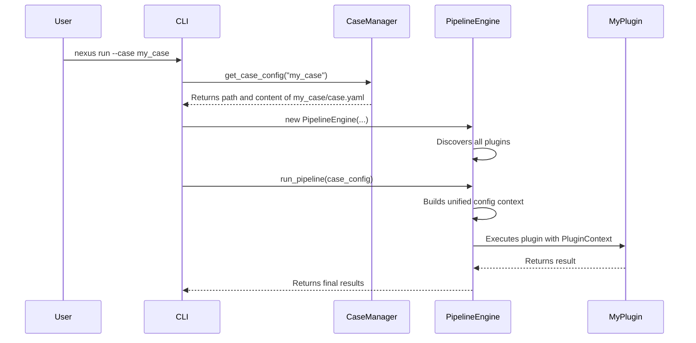

# Nexus Core Framework: An Architectural Overview

---

## Slide 1: Title

**Nexus Core Framework**

*The Engine Behind Your Extensible Data Processing Pipelines*

---

## Slide 2: Core Philosophy: What is Nexus Core?

**Essence:** Nexus Core is not an application; it is a **powerful foundation** for building modular, configuration-driven data processing applications.

**Key Principles:**
- **Configuration over Code**: Define and customize your pipeline's behavior through simple YAML files, not by changing code.
- **Extensible Plugin Architecture**: Easily add new capabilities by writing simple Python functions. Any function can become a reusable pipeline step.
- **Separation of Concerns**: The framework clearly separates the "what" (your plugin's logic) from the "how" (the pipeline orchestration, configuration, and data handling).

---

## Slide 3: High-Level Architecture

At its heart, the system is composed of three main parts that work together: the **Configuration**, the **Engine**, and the **Plugins**.



1.  The **Configuration System** reads all YAML files to create a unified view of the settings.
2.  The **Pipeline Engine** uses this configuration to orchestrate the pipeline.
3.  The **Engine** discovers and executes **Plugins** in the specified order.

---

## Slide 4: The Configuration System

**Essence:** A flexible, hierarchical system that merges settings from multiple sources into a single, immutable context.

**Hierarchy of Precedence (Highest to Lowest):**
1.  **CLI Overrides**: `--config key=value` (For one-time tweaks)
2.  **Case / Template Config**: `case.yaml` or a chosen template (Defines the specific pipeline)
3.  **Global Config**: `config/global.yaml` (Shared settings across all pipelines)
4.  **Plugin Defaults**: Default values defined in the plugin's code.

**Key Feature: `@defaults` References**
Reduce duplication by defining shared configuration blocks in a `defaults` section and referencing them elsewhere.
```yaml
defaults:
  my_shared_settings:
    tolerance_ms: 1000
    
pipeline:
  - plugin: MyPlugin
    config:
      _extends: "@defaults.my_shared_settings" # Inherits the tolerance
      retries: 3 # Adds a local value
```

---

## Slide 5: The Plugin System

**Essence:** The heart of Nexus's extensibility. It allows you to turn almost any Python function into a reusable, configurable pipeline step.

**How it Works:**
A simple `@plugin` decorator is all you need to register a function.

```python
from nexus.core import plugin
from nexus.core.context import PluginContext

@plugin(name="My Awesome Plugin")
def my_plugin_function(ctx: PluginContext):
    # Your logic here...
    # Access config via ctx.config
    # Share data via ctx.remember() / ctx.recall()
    print("Plugin is running!")
```
- The **`PluginManager`** automatically discovers all functions decorated with `@plugin`.
- It supports Pydantic models for automatic configuration validation and type safety.

---

## Slide 6: The Pipeline Engine

**Essence:** The orchestrator that brings everything together and executes the pipeline from start to finish.

**Execution Flow:**
1.  **Load Case**: The engine is initialized with a specific "case" (a workspace). It uses the `CaseManager` to load the `case.yaml` or a specified template.
2.  **Build Configuration**: It merges all configuration sources (CLI, case, global) into a single context.
3.  **Discover Plugins**: It ensures that all available plugins are discovered and registered.
4.  **Execute Pipeline**: It iterates through the `pipeline` list in the configuration and executes each plugin sequentially, passing it the necessary context.

---

## Slide 7: Context: The State of the Pipeline

**Essence:** A set of objects that hold the "state" of the pipeline run and provide utilities to plugins.

**Two Types of Context:**

1.  **`NexusContext` (Global)**
    - Created once per pipeline run.
    - **Immutable** (`frozen`).
    - Contains global information like project paths and the full run configuration.

2.  **`PluginContext` (Per-Plugin)**
    - Created for each plugin execution.
    - **Mutable**.
    - Holds the plugin-specific configuration (`ctx.config`).
    - Provides a `shared_state` dictionary (`ctx.remember()` and `ctx.recall()`) for plugins to pass data to each other.
    - Offers helper methods like `ctx.resolve_path()` to handle file paths consistently.

---

## Slide 8: Putting It All Together

This diagram shows how a `nexus run` command triggers the entire process.



---

## Slide 9: Summary

- **Nexus Core** is a robust and flexible framework for building data processing pipelines.
- Its strength lies in its **powerful configuration system** and **simple, extensible plugin architecture**.
- The clear **separation of concerns** between the engine, configuration, and plugins makes it easy to maintain and extend.
- By understanding these core concepts, you can build complex and powerful applications with Nexus.
